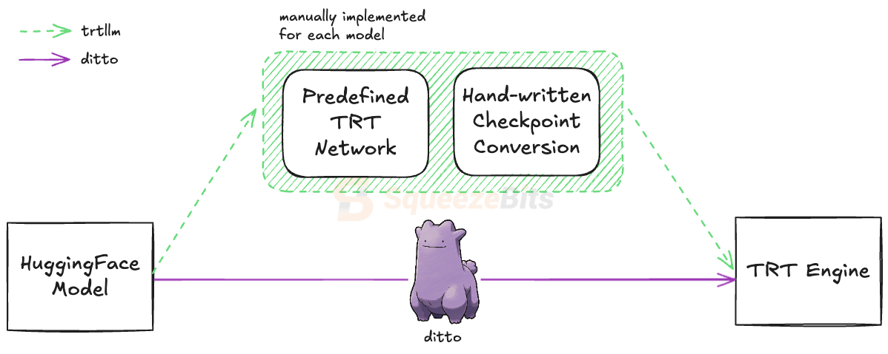

<div align="center">


[](https://github.com/NVIDIA/TensorRT-LLM)
[](https://github.com/pytorch/TensorRT)
[](#)
[](./LICENSE)

<div align="left">

# Ditto - Direct Torch to TensorRT-LLM Optimizer

Ditto is an open-source framework that enables **direct conversion of HuggingFace `PreTrainedModel`s into TensorRT-LLM engines**. Normally, building a TensorRT-LLM engine consists of two steps - checkpoint conversion and `trtllm-build` - both of which rely on pre-defined model architectures. As a result, converting a novel model requires porting the model with [TensorRT-LLM's Python API](https://github.com/NVIDIA/TensorRT-LLM?tab=readme-ov-file#tensorrt-llm-overview) and writing a custom checkpoint conversion script. **By automating these dull procedures, Ditto aims to make TensorRT-LLM more accessible to the broader AI community**.

<div align="center">

<div align="left">

## Latest News
- [2025/02] Blog post introducing Ditto is published! [[Blog](https://blog.squeezebits.com/the-missing-piece-of-tensorrtllm-42462)]
- [2025/02] Ditto 0.1.0 released!
- [2025/04] Ditto 0.2.0 released with new features - MoE, Quantization

## Getting Started
* [Installation](docs/GUIDE.md#a-installation)
* [Quick Start Guide](docs/GUIDE.md#b-quick-start-guide)
* [Debugging](docs/DEBUG.md)


## Key Advantages
- Ease-of-use: Ditto enables users to convert models with a single command.
  ```
  ditto build <huggingface-model-name>
  ```
- Enables conversion of novel model architectures into TensorRT engines, including models that are not supported in TensorRT-LLM due to the absence of checkpoint conversion scripts.
    - For example, as of the publication date of this document (February 10, 2025), [Helium](https://huggingface.co/kyutai/helium-1-preview-2b) is supported in Ditto, while it is not in TensorRT-LLM. (Note that you need to re-install transformers nightly-build after installing Ditto as `pip install git+https://github.com/huggingface/transformers.git`)
- Directly converts quantized HuggingFace models.

## Benchmarks

We have conducted comprehensive benchmarks for both output quality and inference performance to validate the conversion process of Ditto. [Llama3.3-70B-Instruct](https://huggingface.co/meta-llama/Llama-3.3-70B-Instruct), [Llama3.1-8B-Instruct](https://huggingface.co/meta-llama/Llama-3.1-8B-Instruct), and [Helium1-preview-2B](https://huggingface.co/kyutai/helium-1-preview-2b) were used for the benchmarks and all benchmarks were performed with both GEMM and GPT attention plugins enabled.


### Quality
We used [TensorRT-LLM llmapi](https://github.com/NVIDIA/TensorRT-LLM/tree/main/tensorrt_llm/llmapi) integrated with [lm-evaluation-harness](https://github.com/EleutherAI/lm-evaluation-harness/tree/main) for quality evaluation. For Helium model, ifeval task was excluded since it is not an instruction model.
<table>
  <tr>
    <th></th>
    <th></th>
    <th align="center">MMLU<br/>(Accuracy)</th>
    <th align="center">wikitext2<br/>(PPL)</th>
    <th align="center">gpqa_main<br/>_zeroshot<br/>(Accuracy)</th>
    <th align="center">arc_challenge<br/>(Accuracy)</th>
    <th align="center">ifeval<br/>(Accuracy)</th>
  </tr>
  <tr>
    <td rowspan="2">Llama3.3-70B-Instruct</td>
    <td>Ditto</td>
    <td align="center">0.819</td>
    <td align="center">3.96</td>
    <td align="center">0.507</td>
    <td align="center">0.928</td>
    <td align="center">0.915</td>
  </tr>
  <tr>
    <td>TRT-LLM</td>
    <td align="center">0.819</td>
    <td align="center">3.96</td>
    <td align="center">0.507</td>
    <td align="center">0.928</td>
    <td align="center">0.915</td>
  </tr>
  <tr>
    <td rowspan="2">Llama3.1-8B-Instruct</td>
    <td>Ditto</td>
    <td align="center">0.680</td>
    <td align="center">8.64</td>
    <td align="center">0.350</td>
    <td align="center">0.823</td>
    <td align="center">0.815</td>
  </tr>
  <tr>
    <td>TRT-LLM</td>
    <td align="center">0.680</td>
    <td align="center">8.64</td>
    <td align="center">0.350</td>
    <td align="center">0.823</td>
    <td align="center">0.815</td>
  </tr>
  <tr>
    <td rowspan="2">Helium1-preview-2B</td>
    <td>Ditto</td>
    <td align="center">0.486</td>
    <td align="center">11.37</td>
    <td align="center">0.263</td>
    <td align="center">0.578</td>
    <td align="center">-</td>
  </tr>
  <tr>
    <td>TRT-LLM</td>
    <td colspan="5" align="center">Not Supported</td>
  </tr>
</table>

*NOTE: All tasks were tested as 0-shot.*

### Throughput
Performance benchmarks were conducted using [TensorRT-LLM gptManagerBenchmark](https://github.com/NVIDIA/TensorRT-LLM/tree/main/benchmarks/cpp). A100 in the table represents A100-SXM4-80GB.
<table>
  <tr>
    <th></th>
    <th></th>
    <th align="center">TP</th>
    <th align="center">A100<br/>(token/sec)</th>
    <th align="center">A6000<br/>(token/sec)</th>
    <th align="center">L40<br/>(token/sec)</th>
  </tr>
  <tr>
    <td rowspan="2">Llama3.3-70B-Instruct</td>
    <td>Ditto</td>
    <td align="center">4</td>
    <td align="center">1759.2</td>
    <td align="center">-</td>
    <td align="center">-</td>
  </tr>
  <tr>
    <td>TRT-LLM</td>
    <td align="center">4</td>
    <td align="center">1751.6</td>
    <td align="center">-</td>
    <td align="center">-</td>
  </tr>
  <tr>
    <td rowspan="2">Llama3.1-8B-Instruct</td>
    <td>Ditto</td>
    <td align="center">1</td>
    <td align="center">3357.9</td>
    <td align="center">1479.8</td>
    <td align="center">1085.2</td>
  </tr>
  <tr>
    <td>TRT-LLM</td>
    <td align="center">1</td>
    <td align="center">3318.0</td>
    <td align="center">1508.6</td>
    <td align="center">1086.5</td>
  </tr>
  <tr>
    <td rowspan="2">Helium1-preview-2B</td>
    <td>Ditto</td>
    <td align="center">1</td>
    <td align="center">-</td>
    <td align="center">1439.5</td>
    <td align="center">1340.5</td>
  </tr>
  <tr>
    <td>TRT-LLM</td>
    <td align="center">1</td>
    <td colspan="4" align="center">Not Supported</td>
  </tr>
</table>

## Support Matrix

### Models
- Llama2-7B
- Llama3-8B
- LLama3.1-8B
- Llama3.2
- Llama3.3-70B
- Mistral-7B
- Gemma2-9B
- Phi4
- Phi3.5-mini
- Qwen2-7B
- Codellama
- Codestral
- ExaOne3.5-8B
- aya-expanse-8B
- Llama-DNA-1.0-8B
- SOLAR-10.7B
- Falcon
- Nemotron
- 42dot_LLM-SFT-1.3B
- Helium1-2B
- Sky-T1-32B
- SmolLM2-1.7B
- Mixtral-8x7B
- Qwen-MoE
- DeepSeek-V1, V2
- and many others that we haven't tested yet

### Features
- Multi LoRA
- Tensor Parallelism / Pipeline Parallelism
- Mixture of Experts
- Quantization - Weight-only & FP8 ([AutoAWQ](https://github.com/casper-hansen/AutoAWQ), [AutoGPTQ](https://github.com/AutoGPTQ/AutoGPTQ), [Compressed Tensors](https://github.com/neuralmagic/compressed-tensors))

## What's Next?
Below features are planned to be supported in Ditto in the near future. Feel free to reach out if you have any questions or suggestions.
- Additional Quantization Support
- Expert Parallelism
- Multimodal
- Speculative Decoding
- Prefix Caching
- State Space Model
- Encode-Decoder Model

## References
- [TensorRT-LLM](https://github.com/NVIDIA/TensorRT-LLM)
- [Torch-TensorRT](https://github.com/pytorch/Torch-TensorRT)
