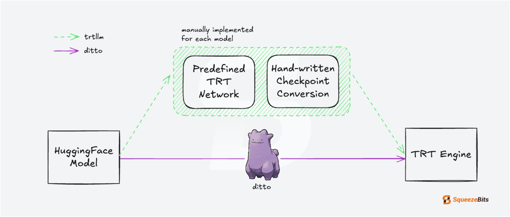

# Ditto - Direct Torch to TensorRT-LLM Optimizer

Ditto is an open-source framework that enables **building TensorRT engines directly from PyTorch HuggingFace models**. Traditionally, building a TensorRT engine for a new transformer model requires implementing the model definition with TensorRT networks and converting the checkpoint into the corresponding format. Ditto eliminates the intermediate steps, allowing transformer models to be directly converted into TensorRT engines without additional effort. By simplifying this process, **Ditto aims to maximize efficiency in deploying transformer models on TensorRT**.

## Key Advantages
- Directly converting new HF models into TensorRT engines that are not supported by TensorRT-LLM.
    - As of the publication date of this document (February 10, 2025), [Helium](https://huggingface.co/kyutai/helium-1-preview-2b) is supported in Ditto, while it is not in TensorRT-LLM.
- Directly converting quantized HF models.
- Enhancing the usability of custom plugins.
- Allowing for more flexible development of model architectures.

## Benchmarks

### Accuracy
TBD

### Latency
TBD

## Support Matrix

### Models
- Llama2-7B
- Llama3-8B
- LLama3.1-8B
- Llama3.2
- Llama3.3-70B
- Mistral-7B
- Gemma2-9B
- Phi4
- Phi3.5-mini
- Qwen2-7B
- Codellama
- Codestral
- ExaOne3.5-8B
- aya-expanse-8B
- Llama-DNA-1.0-8B
- SOLAR-10.7B
- Falcon
- Nemotron
- 42dot_LLM-SFT-1.3B
- Helium1-2B
- Sky-T1-32B
- SmolLM2-1.7B
- and many others that we haven't tested yet

### Plugins
- GPTAttentionPlugin
- GemmPlugin
- LoRAPlugin
- AllGatherPlugin, AllReducePlugin(for Tensor Parallelism)

## What's Next?
- Quantization
- MoE
- Multimodal
- Speculative Decoding
- Prefix Caching
- Pipeline Parallelism
- State Space Model
- Encode-Decoder Model

## Getting Started
Refer to [GUIDE.md](docs/GUIDE.md) for detailed usage.
